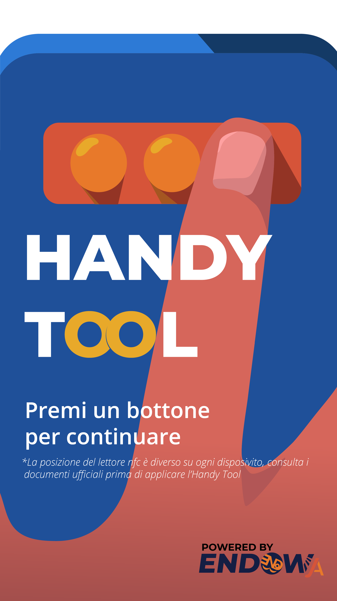
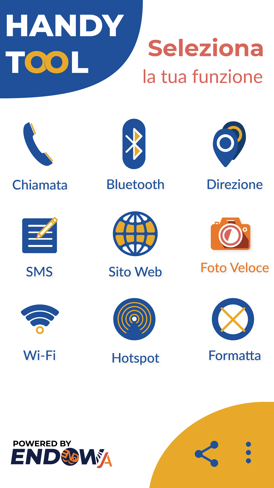
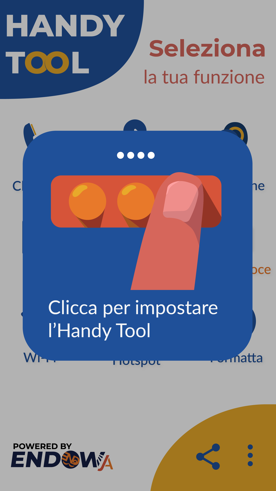

## Handy Tool
#### Description:
A Simple android Application that helps users to customize their NFC tags for certain smartphone functionality 
**note**: currently only supports Italian

#### Functionality List: 

- `Svuota`      -- *clear the current functionality stored*       
- `Direzione`   -- *open google maps and automatically get the best route from current position to a predefined destination*      
- `Chiamata`    -- *call a predefined phone number*      
- `SMS`         -- *send a SMS to a predefined phone number*            
- `Foto`        -- *take a quick picture*            
- `Web`         -- *open a predefined url*            
- `Bluetooth`   -- *activate Bluetooth*
- `Wifi`        -- *activate wifi*
- `Hotspot`     -- *activate hotspot*
- `App`         -- *open a predefined application*
- `Torcia`,     -- *open flashlight*
- `Screenshot`  -- *take a screenshot* 
- `Mo. Silen.`  -- *activate silence mode*
- `Home`        -- *get back to home screen* 

## Project Status
- [x] UI
    + [x] Home page
    + [x] Splash screen with animation
    + [x] Icons
    + [x] Setting page
- [x] Define function mapping
- [x] Read/Write via NFC
- [x] find various functionalities' implementation 

## Project preview
splash screen          | home page          | store new functionality
:-------------------------:|:-------------------------:|:-------------------------:|
</img> |</img> | </img>

## Reflection

This was a team project and we wanted to make a mobile application for our nfc tags that can stick to the back of smartphone and act like extra phisical buttons. Our application needs to be able to perform correspoding actions based on the functionality previously stored in each of the button when they are tapped. 
